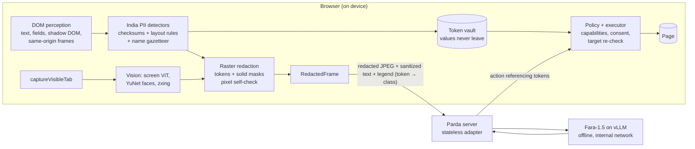

# Shutter

**On-device visual perception and PII redaction for lightweight browser agents.**
SIH 2026 · Problem statement SIH26171 (ISRO).

Shutter is a Chrome extension. It fills the form you have open, and the personal data stays on the laptop. The page is perceived on the device. Values are replaced with typed placeholders such as `[AADHAAR_1]` in the frame the panel shows. A value is typed back only into a matching field, and only after you approve. No server is required.

An optional open-weights model, Microsoft Fara-1.5 served offline with vLLM, can plan those actions instead. That path is for measurement. It is not required to use the extension.



## What leaves the device

Per step, the POST body to the server contains exactly: the task text with values tokenized, the
legend (`[EMAIL_1] → EMAIL`, never values), the viewport size, up to three redacted screenshots,
URLs reduced to origin and path with PII segments tokenized and query values dropped, and
text observations (refusal reasons, `read_page` text) passed through the same detectors. The side
panel shows the exact body and its SHA-256 for every step.

The network client only accepts the `RedactedFrame` type, which only the renderer can produce, and
the renderer refuses to encode a frame unless every mask reads back with its fill colour. The
screenshot is captured only if the agent's tab is in front before and after, with no tab switch in
between; if the page changes between perception and capture, the step retries and, after four
attempts, sends nothing. The extension CSP limits `connect-src` to the configured server.

Actions come back referencing tokens. A token is filled only into a field whose class is compatible
(an email token cannot be typed into a phone or unclassified field), values seen on a page stay on
that page's origin, and passwords, OTPs, CVVs and secrets are never released. The page re-derives
the target right before executing, so a page that swaps the element or moves focus during approval is
refused. Navigations whose URL contains detectable PII are denied.

## Measured results

All numbers come from `bench/` (headless Chromium, 1440×900, DOM perception + planning in the page).
Metrics are mask-based against pixel ground truth:
- **Item recall** is the share of PII items at least 90% covered.
- **Pixel leakage** is the share of PII pixels left visible.
- **Detection precision** is the share of text detections that lie on real PII.
- **Redaction precision** is the share of masked pixels that are PII, media masks included.
- **Context retained** is the share of non-PII text pixels left readable.

Three corpora of Indian portal pages exist. The detector was developed against the first. The other
two were written blind by different models (GPT-5.6 and Gemini 3.8) that were not allowed to read the
detector code. **The blind columns are each corpus's first run, before any change informed by it;
they are the honest generalisation numbers.** The "after" columns are shown for transparency and are
not blind.

| Corpus | Pages | Item recall | Pixel leakage | Detection precision | Context retained |
|---|---|---|---|---|---|
| Development (8 templates) | 120 | 100% | 0% | 85.6% | 96.8% |
| Held-out 1, **blind** | 64 | **72.3%** | **16.3%** | 73.6% | 95.9% |
| Held-out 1, after fixes | 64 | 99.9% | 0.2% | 66.1% | 90.7% |
| Held-out 2, **blind** | 64 | **72.3%** | **20.3%** | 89.2% | 97.6% |
| Held-out 2, after name gazetteer | 64 | 84.8% | 13.5% | 90.6% | 97.6% |

Baselines on the development corpus:
- **Raw screenshot:** 0% recall, 100% leakage.
- **Blanket masking of all text and media:** 100% recall, 0% context retained, 25.5% redaction precision.
- **Parda:** 53.7% redaction precision.

Structured identifiers reached 100% recall in both blind runs: Aadhaar (with Verhoeff), PAN, GSTIN
(with its check character), cards (with Luhn), IFSC, UPI, phone, email, OTP, CVV, bank account and
DOB. There were two exceptions. Secrets scored 50% on held-out 1 because a Stripe-style key prefix
was unknown; it has been added since. Passports scored 87.5% on held-out 2. The remaining gap is **names and free-text addresses** without labels. On held-out 2, person recall
is 59.9% and address recall 50%, for example addresses typed into chat bubbles or names outside the
gazetteer. This is where a small on-device NER model is the next step.

**On-device screen ViT** (RF-DETR Nano, DINOv2 backbone, fine-tuned on 6,000 synthetic 16:10
screens; never trained on the held-out layouts). Thresholds were chosen on a validation split of
the training generator, then the held-out set was scored once. Inference is ONNX, 384×384,
39.9 MB, onnxruntime CPU:

| Split | FACE | TEXT R | SIGNATURE R | Sensitive pixels masked | Mask pixels on sensitive GT |
|---|---|---|---|---|---|
| Val (same generator) | 100% | 100% | 100% | 98.9% | 99.5% |
| Held-out layouts | **100%** | **92.9%** | **93.7%** | **77.6%** | 45.1% |

Held-out box precision for `ID_DOCUMENT` is 38.4%: the model also boxes shipping labels and similar
cards that the GT file did not call documents. That over-masks (safer for leakage, worse for
context). Buttons on held-out are 100% P/R; inputs are 100% recall / 58% precision. A from-scratch
tiny DETR trained on the same data scored 0% on every sensitive class and is not shipped.

**Real Chromium pages** (not the PIL generator). `bench/src/real.ts` screenshots the scholarship
demo portal and three canvas e-IDs at 1440×900, then the shipped ONNX is scored with frozen
thresholds. Canvas glyphs are invisible to the DOM.

| Page | DOM-only canvas recall | ViT canvas glyphs | DOM+ViT (what the extension sends) | Strict-media canvas |
|---|---|---|---|---|
| Demo portal (form + canvas e-ID) | 0% | 100% | canvas PII painted out; form labels kept | 100% (whole canvas) |
| Three canvas e-IDs | 0% | 100% | 100% | 100% |

The fake server accepted the redacted JPEG (`POST /v1/step` → 200, a click, no tripwire).
Inside Chromium, onnxruntime-web WASM runs the same 39.9 MB model in **551 ms** median
(load **547 ms** once). Native CPU remains ~53 ms.

**On-device cost:**
- DOM perception plus redaction planning takes 2.9 ms at the median and 5.0 ms at p95 per page on the development corpus.
- The content script is 47 KB.
- Screen ViT is 39.9 MB ONNX, 52 ms median native CPU; **551 ms median in Chromium WASM** (the side panel path), 547 ms to load. YuNet is 233 KB; zxing is 954 KB of WASM. ONNX Runtime Web adds 28 MB of WASM, loaded locally, never from a CDN.
- No redacted frame was rejected by the render self-check across all 248 benchmark pages.

**Not yet measured, and not claimed:**
- End-to-end task success with Fara-1.5 on real sites. This is the visual-context-accuracy criterion; the server is tested with a scripted provider.
- Screen-ViT latency inside the Chrome extension on WebGPU (WASM is 551 ms median on these pages).
- In-extension capture and encode latency on real hardware.
- Extension memory footprint. The benchmark's 196 MB heap figure is the whole page plus probe, not Parda.

## Use the extension

No server.

```bash
cd extension && npm ci && npm run build
```

In Chrome, open `chrome://extensions`, turn on Developer mode, and Load unpacked `extension/.output/chrome-mv3`. Open a form, open the Shutter side panel, write the task, and press Start.

## Develop and measure

```bash
npm ci
npm test --workspace @parda/core          # detectors, vault, policy
cd bench && npm run bench                 # development corpus -> bench/out/summary.md
npm run heldout && npm run heldout2       # blind corpora -> bench/out/heldout*/summary.md
```

Server (Python 3.12):

```bash
cd server && pip install -e ".[dev]" && pytest -q
PARDA_PROVIDER=fake uvicorn parda_server.app:app --port 8000     # scripted model, no GPU
# Real model, fully offline after one download:
./scripts/fetch_model.sh microsoft/Fara1.5-4B && MODEL=microsoft/Fara1.5-4B docker compose up
```

The compose file puts vLLM on an internal network with no route out and publishes only the adapter,
on `127.0.0.1`. The adapter reproduces Fara's system prompt byte for byte (golden tests against
upstream), keeps Fara's three-image history, maps its 1000×1000 action space to viewport pixels, and
rejects any request whose text still contains raw PII (a tripwire, counted in `/v1/info`).

The extension build above does not need `PARDA_SERVER`. The commands in this section are for the optional server and the benchmarks.

Demo page: serve `demo/portal` over http (not `file://`), load the unpacked extension, fill the form, click **Copy Shutter task**, paste it in the side panel, Start. Shutter submits on the laptop. `cd bench && npm run demo` is the scripted check of the optional server.

```bash
cd server && set PARDA_PROVIDER=fake&& .venv\Scripts\python -m uvicorn parda_server.app:app --host 127.0.0.1 --port 8000
python -m http.server 5500 --directory demo/portal
# Chrome → http://127.0.0.1:5500 → side panel → paste task → Start
```

```bash
cd bench && npm run real                  # Chromium dumps -> bench/out/real
# then: models/.venv python models/screen-vit/eval_real.py
cd bench && npm run vision-web            # WASM latency of the shipped ONNX
```

Screen ViT training (Python 3.11, CUDA GPU; writes `models/screen-vit/export/`):

```bash
cd models/screen-vit
# ..\.venv with requirements.txt already installed
python make_coco.py && python finetune.py && python eval_onnx.py
```

## Repository

| Path | Contents |
|---|---|
| `packages/core` | Pure TypeScript: PII rules and checksums, name gazetteer, token vault, sanitizers, redaction planner, action policy. |
| `extension` | WXT Chrome MV3 extension: perception, capture pipeline, renderer, vision models, agent loop, side panel. |
| `server` | FastAPI adapter for Fara-1.5 on vLLM, tripwire, scripted provider, Docker Compose. |
| `bench` | Corpus generators (development + two blind) and the Playwright scoring harness. |
| `models/screen-vit` | RF-DETR Nano fine-tune, synthetic COCO export, ONNX eval. |
| `demo/portal` | Static scholarship-portal page with a canvas e-ID. |
| `docs` | Threat model, deck prompt. |

## Third-party components

| Component | Use | License |
|---|---|---|
| Microsoft Fara-1.5 (4B/9B) | Server computer-use model; prompt text vendored | MIT (per upstream repository; confirm on the model card) |
| vLLM | Model serving | Apache-2.0 |
| RF-DETR Nano (Roboflow) | On-device screen detector backbone, fine-tuned | Apache-2.0 |
| YuNet face detector (OpenCV Zoo, 2023mar) | On-device face masking | MIT (confirm in opencv_zoo) |
| ONNX Runtime Web | On-device inference | MIT |
| zxing-wasm / zxing-cpp | QR, PDF417, DataMatrix, Aztec detection | MIT / Apache-2.0 |
| WXT, Playwright | Extension build, benchmark | MIT, Apache-2.0 |

Parda itself is Apache-2.0.
